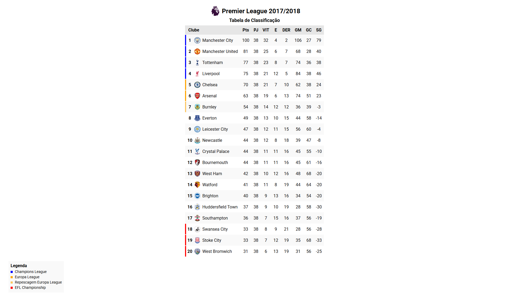

<h1>📊 Premier League 2017/2018 - Tabela de Classificação</h1>

  Este projeto consiste em uma página web desenvolvida com <strong>HTML5</strong> e <strong>CSS3</strong>,
  apresentando a tabela de classificação da temporada 2017/2018 da Premier League.
  O objetivo principal é praticar conceitos de estruturação semântica e estilização de tabelas
  com foco em organização, visual agradável e responsividade.

<h2>🚀 Funcionalidades</h2>
<ul>
  <li>Tabela completa com os 20 clubes participantes</li>
  <li>Escudos dos times exibidos ao lado do nome</li>
  <li>Colunas com dados de pontos, vitórias, empates, derrotas, saldo de gols, etc.</li>
  <li>Primeira coluna fixa ao rolar horizontalmente (usando <code>position: sticky</code>)</li>
  <li>Legenda visual indicando os clubes classificados para competições europeias e rebaixamento</li>
</ul>

<h2>🔍 Legenda de Classificação</h2>

A tabela inclui uma legenda que destaca, por meio de cores diferentes, os clubes de acordo com sua classificação final:

<ul>
  <li>🔵 Champions League: 1º ao 4º lugar</li>
  <li>🟠 Europa League: 5º e 6º lugares</li>
  <li>🟡 Repescagem Europa League: 7º lugar</li>
  <li>🔴 EFL Championship: 18º ao 20º lugar (rebaixados)</li>
</ul>

<h2>🛠️ Tecnologias utilizadas</h2>
<ul>
  <li>HTML5</li>
  <li>CSS3</li>
  <li>Google Fonts (Roboto)</li>
  <li>Imagens dos escudos hospedadas localmente</li>
</ul>

<h2>💡 Objetivo do Projeto</h2>

  Este site foi desenvolvido com fins educacionais para treinar habilidades de <strong>HTML</strong> e <strong>CSS</strong>,
  focando na construção de tabelas com design moderno, alinhamento de conteúdo,
  uso de fontes personalizadas e elementos gráficos.

<h2>📁 Como visualizar</h2>

  Você pode abrir o arquivo <code>index.html</code> diretamente no navegador após clonar ou baixar este repositório, 
  ou acessar o projeto hospedado em:

  👉 <a href="https://guimartim.github.io/table-premier-league/" target="_blank">https://guimartim.github.io/table-premier-league/</a>

